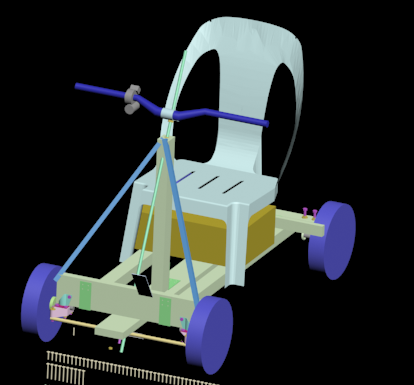
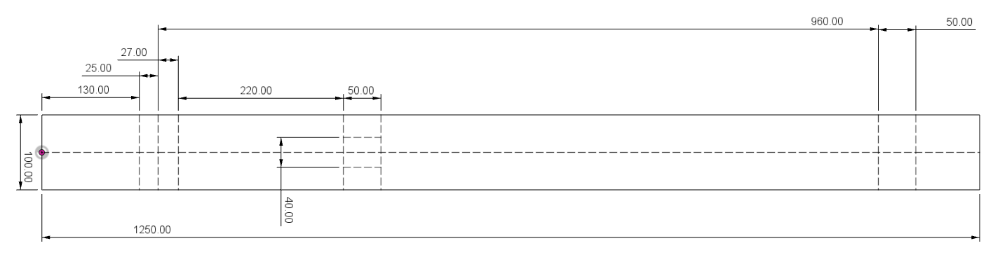
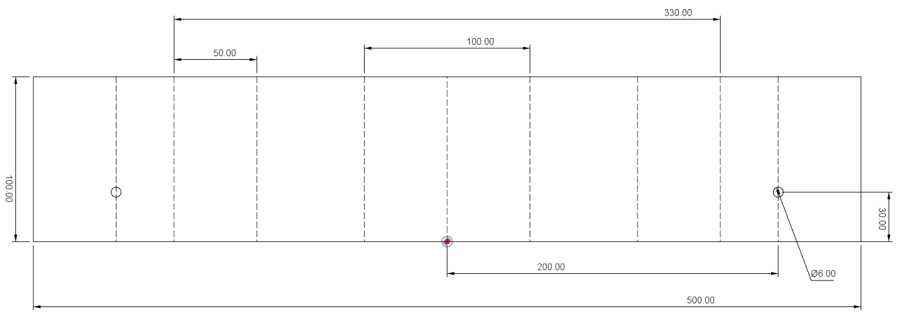
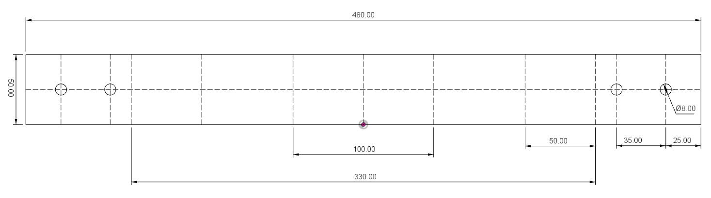
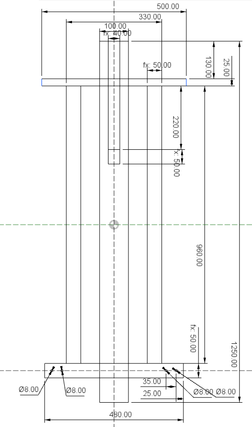

# Scooter4EWD 
**Scooter 4 electric wheel drive** - электрическое транспортного средства с четырьмя мотор колесами, на одну персону, созданное из доступных материалов.

## Перед началом
Все ниже описанное является собственным опытом и должно расцениваться как хобби, при попытке повторить вы должны оценить как материальные затраты > 30 000 рублей, так и временные ресурсы.

## Список деталей

| №  | Деталь                       | шт | Цена      | Сумма     |
| --- | ---------------------------- | ---| --------- | --------- |
| [1](readme/part/01part.md) | [Колесо гироскутера](readme/part/01part.md) | 4 | | 15000 (цена за 2 гироскутера) |
| [2](readme/part/02part.md) | [Брус 25х100х1250 (центральный лонжерон)](readme/part/02part.md) | 1 | | 100 |
| [3](readme/part/03part.md) | [Брус 25х100х500 (передняя ось)](readme/part/03part.md) | 1 | | |
| [4](readme/part/04part.md) | [Брус 40х50х960 (боковой лонжерон)](readme/part/04part.md) | 2 | | 150 |
| [5](readme/part/05part.md) | [Брус 40х50х480 (задняя ось)](readme/part/05part.md) | 1 | | |
| [6](readme/part/06part.md) | [Брус 40х50х407 (стойка рулевой колонки)](readme/part/06part.md) | 1 | | |
| [7](readme/part/07part.md) | [Брус 18х36х600 (Тормоз)](readme/part/07part.md) | 1 | | 50 |
| [8](readme/part/08part.md) | [Уголок 40х40](readme/part/08part.md) | 2 | 10 | 20 |
| [9](readme/part/09part.md) | [Уголок 40х95](readme/part/09part.md) | 3 | 20 | 60 |
| [10](readme/part/10part.md) | [Пластина 35х100](readme/part/10part.md)| 4 | 10 | 40 |
| [11](readme/part/11part.md) | [Рым гайка м8](readme/part/11part.md)| 4 | 70 | 280 |
| [12](readme/part/12part.md) | [Болт м8х80](readme/part/12part.md)| 4 | 15 | 60 |
| [13](readme/part/13part.md) | [Болт м8х50](readme/part/13part.md)| 1 | 10 | 10 |
| [14](readme/part/14part.md) | [Гайка м8х24](readme/part/14part.md)| 1 | 30 | 30 |
| [15](readme/part/15part.md) | [Гайка м8](readme/part/15part.md)| 5 | 10 | 50 |
| [16](readme/part/16part.md) | [Шайба м8](readme/part/16part.md)| 4 | 5 | 20 |
| [17](readme/part/17part.md) | [Болт м6х40](readme/part/17part.md)| 10 | 10 | 100 |
| [18](readme/part/18part.md) | [Гайка м6](readme/part/18part.md)| 11 | | 50 |
| [19](readme/part/19part.md) | [Шайба м6](readme/part/19part.md)| 8 | | 40 |
| [20](readme/part/20part.md) | [Колесо мебельное 43х58 d40](readme/part/20part.md)| 2 | | 300 |
| [21](readme/part/21part.md) | [Болт м5х50](readme/part/21part.md)| 2 | | 30 |
| [22](readme/part/22part.md) | [Гайка м5](readme/part/22part.md)| 4 | | 20 |
| [23](readme/part/23part.md) | [Шайба м5](readme/part/23part.md)| 2 | | 10 |
| [24](readme/part/24part.md) | [Ось руля 20х20х1000](readme/part/24part.md)| 1 | | 75 |
| 25 | | | | |
| 26 | | | | |
| [27](readme/part/27part.md) | [Трубка алюминиевая d12х480](readme/part/27part.md)| 1 | | 50 |
| [28](readme/part/28part.md) | [Пластина 25х60](readme/part/28part.md)| 1 | | 20 |
| [29](readme/part/29part.md) | [Вынос руля](readme/part/29part.md)| 1 | | 25 |
| [30](readme/part/30part.md) | [Уголок алюминиевый 15х580](readme/part/30part.md)| 2 | | 100 |
| [31](readme/part/31part.md) | [Стул пластмассовый](readme/part/31part.md)| 1 | | 300 |
| [32](readme/part/32part.md) | [Руль велосипедный](readme/part/32part.md)| 1 | | 600 |
| [33](readme/part/33part.md) | [Ручка газа](readme/part/33part.md)| 1 | | 460 |
| [34](readme/part/34part.md) | [Саморез 25](readme/part/34part.md)| 59 | | 100 |
| [35](readme/part/35part.md) | [Саморез 50](readme/part/35part.md)| 10 | | 20 |
| [36](readme/part/36part.md) | [Стяжка 3х200](readme/part/36part.md)| 17 | | 150 |
| [37](readme/part/37part.md) | [Поворотный механизм - петля](readme/part/37part.md)| 1 | | 200 |
| [38](readme/part/38part.md) | [Чемодан](readme/part/38part.md)| 1 | | 1500 |
| [39](readme/part/39part.md) | [Разъем DHS-78](readme/part/39part.md)| 1 | | 400 |
| [40](readme/part/40part.md) | [Провод силовой](readme/part/40part.md)| 10 | | |
| [41](readme/part/41part.md) | [Витая пара](readme/part/41part.md)| 10 | | |
| [42](readme/part/42part.md) | [Рукав металлический](readme/part/42part.md)| 1 | | 50 |
| [43](readme/part/43part.md) | [Клеммная колодка](readme/part/43part.md)| 4 | | 50 |
| [44](readme/part/44part.md) | [Трос d3мм в изоляторе](readme/part/44part.md)| 2м | | 40 |
| [45](readme/part/45part.md) | [Блок для троса](readme/part/45part.md)| 1 | | 70 |
| [46](readme/part/46part.md) | [Зажим для троса](readme/part/46part.md)| 2 | | 20 |
| [47](readme/part/47part.md) | [Пружина на растяжение](readme/part/47part.md)| 2 | 24 | 48 |
| [48](readme/part/48part.md) | [Болт крюк м6](readme/part/48part.md)| 1 | 40 | 40 |
| [49](readme/part/49part.md) | [Петля ввертная](readme/part/49part.md)| 2 | 45 | 90 |
| [50](readme/part/50part.md) | [Алюминиевый профиль 10х18х400](readme/part/50part.md)| 2 | | 50 |
| [51](readme/part/51part.md) | [Брус 16х51х150 (Педаль тормоза)](readme/part/51part.md)| 1 | | |
| [52](readme/part/52part.md) | [Поворотный механизм - кулак левый](readme/part/52part.md)| 1 | | 300 |
| [53](readme/part/53part.md) | [Поворотный механизм - кулак правый](readme/part/53part.md)| 1 | | 300 |
| [54](readme/part/54part.md) | [Втулка оси руля (низ)](readme/part/54part.md)| 1 | | 300 |
| [55](readme/part/55part.md) | [Подшипник руля (болт)](readme/part/55part.md)| 2 | | 300 |
| [56](readme/part/56part.md) | [Подшипник руля (гайка)](readme/part/56part.md)| 2 | | 300 |
| [57](readme/part/57part.md) | [Втулка оси руля (верх)](readme/part/57part.md)| 1 | | 300 |
| [58](readme/part/58part.md) | [Аккумулятор](readme/part/58part.md)| 2 | 1950 | 3900 |
| [59](readme/part/59part.md) | [Контроллер электродвигателя 350wt](readme/part/59part.md)| 4 | 600 | 2400 |
| [60](readme/part/60part.md) | [Зарядное устройство от героскутера](readme/part/60part.md)| 1 | | |
| [61](readme/part/61part.md) | [Автомат защиты](readme/part/61part.md)| 1 | 150 | 150 |
| [62](readme/part/62part.md) | [Ваттметр](readme/part/62part.md)| 1 | 700 | 700 |
| [63](readme/part/63part.md) | [Кнопка заднего хода](readme/part/63part.md)| 1 | 70 | 70 |
| [64](readme/part/64part.md) | [Кнопка нажатия тормоза](readme/part/64part.md)| 1 | 50 | 50 |
| [65](readme/part/65part.md) | [Блок кнопок на руль](readme/part/65part.md)| 1 | 200 | 200 |
| [66](readme/part/66part.md) | [Грипсы](readme/part/66part.md)| 2 | | 300 |
| | | | **итого** | **30488** |

## Как строить
1. Брус 25х100 нарезать по длине на 1250мм и 500мм, получаем детали центральный лонжерон ([№2](readme/part/02part.md)), 
передняя ось ([№3](readme/part/03part.md)).
1. Наносим разметку на центральный лонжерон ([№2](readme/part/02part.md)). 
   1. Линию вдоль доски - центральную ось (50мм от бока).
   1. Место крепления передней оси ([№3](readme/part/03part.md)): перпендикулярная линия 130мм от края и 
   еще одну через 25мм (155мм от края).
   1. Место крепления стойки руля ([№6](readme/part/06part.md)): перпендикулярная линия 375мм от края, 
   еще одну через 50мм (425мм от края), 
   нарисовать прямоугольник 50х40мм на основе полученных ранее линий и по центру по ширине (20мм от оси).
   1. Место крепления задней оси ([№5](readme/part/05part.md)): перпендикулярная линия 1115мм от края, 
   еще одну через 50мм (1165мм от края). 
1. Просверлить отверстие для руля ([№24](readme/part/24part.md)), диаметр 30мм, на расстоянии 27мм от передней оси (182мм от края), отверстие должно идти под углом 22,5° (его можно получить если из листа А4 вырезать прямоугольный треугольник со сторонами 297мм на 123мм).
1. Наносим разметку на переднюю ось ([№3](readme/part/03part.md)). 
   1. Линию оси (250мм от края).
   1. Линии центрального лонжерона 50мм в обе стороны от ось.
   1. Линии боковых лонжеронов 115мм и 165мм по обе стороны от ось.
   1. Линии крепления передних колес 200мм по обе стороны от ось.
   1. Центр отверстия крепления механизма вращения передних колес, на линии из предыдущего пункта на расстоянии 30мм от бока.
1. Просверлить отверстия диаметром 6мм для крепления механизма вращения передних колес ([№20](readme/part/20part.md)
1. Брус 40х50 нарезать по длине на 960мм два штуки, 480мм, 407мм, получаем детали боковые лонжероны ([№4](readme/part/04part.md)), 
задняя ось ([№5](readme/part/05part.md)), стойка рулевой колонки ([№6](readme/part/06part.md)))
1. Наносим разметку на заднюю ось ([№5](readme/part/05part.md)) 
   1. Линию оси вдоль (25мм от бока).
   1. Линию оси по ширите (240мм от края).
   1. Линии центрального лонжерона 50мм в обе стороны от ось.
   1. Линии боковых лонжеронов 115мм и 165мм по обе стороны от ось.
   1. Линии крепления задних колес 25мм и 60мм по обе стороны от края.
1. Просверлить отверстия диаметром 8мм для крепления задних колес.
1. Собираем основу рамы, на ровной поверхности выкладываем прямоугольник из передней оси ([№3](readme/part/03part.md)), 
лонжероны 2 шт ([№4](readme/part/04part.md)), задняя ось ([№5](readme/part/05part.md)), проверяем что углы прямые
1. Полученный прямоугольник соединяем, заднюю ось ([№5](readme/part/05part.md)) уголками ([№8](readme/part/08big.md) по внутреннему периметру двенадцатью саморезами ([№34](readme/part/34part.md)),
1. Переднюю ось ([№3](readme/part/03part.md)) уголком ([№9](readme/part/09part.md)). 
Уголок необходимо подложить под раму, сначала крепим уголок к передней оси восьмью саморезами ([№34](readme/part/34part.md)), 
затем подымаем раму и фиксируем уголки на боковых лонжеронах 8 саморезами ([№35](readme/part/35part.md)).
1. Усиливаем крепление задней оси прикручивая пластина 35х100 ([№10](readme/part/10part.md)) 12 саморезами ([№34](readme/part/34part.md))
1. Выставляем по центру лонжерон ([№2](readme/part/02part.md)), прикручиваем 6 саморезами ([№35](readme/part/35part.md)), 
три к передней оси ([№3](readme/part/03part.md)), три к задней оси ([№5](readme/part/05part.md)) 

1. На четыре болта ([№12](readme/part/12part.md)) накрутить четыре гайки (№15) и надеть четыре шайбы ([№16](readme/part/16part.md).
1. Болты ([№12](readme/part/12part.md)) вставить в заднюю ось ([№5](readme/part/05part.md)), 
наживить рым гайками ([№11](readme/part/11part.md)). 
1. Пара рым гайками ([№11](readme/part/11part.md)) с одной стороны должна держать ось колеса ([№1](readme/part/01part.md)).
   1. Прижать ось колеса ([№1](readme/part/01part.md)) болтом ([№12](readme/part/12part.md)).
   1. Зафиксировать болт ([№12](readme/part/12part.md)) на оси подтянув гайку ([№11](readme/part/11part.md)).
1. Необходимо добиться параллельности оси колес ([№1](readme/part/01part.md)) к задней оси ([№5](readme/part/05part.md)). 
Проверить под нагрузкой - стать на заднюю ось ([№5](readme/part/05part.md)). 
В случае необходимости, рым гайками ([№11](readme/part/11part.md)), можно подпилить напильником.
1. Мебельное колесо ([№20](readme/part/20part.md)) разобрать, вынуть колесо.
1. Мебельное колесо ([№20](readme/part/20part.md)) крепим к передней оси за ухо в котором было колесико.
1. В поворотный кулак ([№52](readme/part/52part.md)) вставить ось колеса ([№1](readme/part/01part.md)).
1. Поворотный кулак ([№52](readme/part/52part.md)) вместе с колесом ([№1](readme/part/01part.md)) 
крепим к площадке мебельного колеса ([№20](readme/part/20part.md)) четырьмя болтами ([№17](readme/part/17part.md)), 
подкладываем шайбы  ([№19](readme/part/19part.md)), закручиваем гайку ([№18](readme/part/18part.md))
1. Аналогично с другой стороны для ([№53](readme/part/53part.md))
1. Поворотные кулаки ([№52](readme/part/52part.md), [№53](readme/part/53part.md)) между собой соединяем трубкой ([№27](readme/part/27part.md)).
Для этого нам понадобится два болта ([№21](readme/part/21part.md)), две шайбы ([№23](readme/part/21part.md)) и шесть гаек ([№22](readme/part/22part.md))
   1. В трубке ([№27](readme/part/27part.md)) просверлить отверстие диаметром 5мм в 5мм от края. Расстояние между отверстиями должно составлять 480мм.
   1. Болт ([№21](readme/part/21part.md)) продеть в отверстие в трубке ([№27](readme/part/27part.md)).
   1. Наживить гайку ([№22](readme/part/22part.md)) вплотную к трубке ([№27](readme/part/27part.md)).
   1. Смазать болт ([№21](readme/part/21part.md)), можно использовать обычное мыло, этого будет достаточно.
   1. Болт ([№21](readme/part/21part.md)) вкрутить в поворотный кулак ([№52](readme/part/52part.md)).
   1. Затянуть гайку ([№22](readme/part/22part.md)) зафиксировав болт ([№21](readme/part/21part.md)) на трубке.
   1. Надеть шайбу ([№23](readme/part/21part.md)).
   1. Наживить гайку ([№22](readme/part/22part.md)) вплотную к шайбе ([№23](readme/part/21part.md)).
   1. Наживить еще одну гайку ([№22](readme/part/22part.md)) вплотную к предыдущей.
   1. Затянуть гайки между собой, болт ([№21](readme/part/21part.md)) должен свободно вращаться в кулаке ([№52](readme/part/52part.md)).
1. Повторить процедуру с другой стороны
1. К стойку руля ([№6](readme/part/06part.md)) к краю крепим уголок ([№9](readme/part/09part.md)) на четыре самореза ([№34](readme/part/34part.md))
1. Вторую площадку уголка ([№9](readme/part/09part.md)) крепим к центральному лонжерону ([№2](readme/part/02part.md)) на четыре самореза ([№34](readme/part/34part.md)), 
выставив брус ([№6](readme/part/06part.md)) перпендикулярно на размеченный в центре прямоугольник.
1. Нижняя втулка руля ([54](readme/part/54part.md)) крепится двумя саморезами ([№35](readme/part/35part.md)) к передней оси ([№3](readme/part/03part.md))
и двумя саморезами ([№35](readme/part/35part.md)) к центральному лонжерону ([№2](readme/part/02part.md)).
1. Верхняя втулка руля ([57](readme/part/57part.md)) крепится к стойке рулевой колонки ([6](readme/part/06part.md)) 
двумя пластинами ([10](readme/part/10part.md)) с боков на шестнадцать саморезов ([№34](readme/part/34part.md)) 
1. Для увеличение жесткости стойки руля, два уголка ([30](readme/part/30part.md)) крепим к верхней втулке руля ([57](readme/part/57part.md))
с одной стороны и к краю передней оси ([3](readme/part/03part.md)) с другой стороны.
1. TODO Ось руля ([24](readme/part/24part.md)) 
1. TODO Вынос руля ([29](readme/part/29part.md)), руль ([24](readme/part/24part.md))
1. TODO Стул ([31](readme/part/31part.md))
1. TODO Педаль тормоза Петля ввертная ([49](readme/part/49part.md)) Алюминиевый профиль ([50](readme/part/50part.md)) Брус 16х51х150
1. TODO Трос тормоза
1. TODO Уголок крепления блока тормоза
1. TODO Блок тормоза 1
1. TODO Блок тормоза 2
1. TODO Трос
1. TODO Чемодан
1. TODO Аккумулятор
1. TODO Клеммы аккумуляторов
1. TODO Автомат
1. TODO Клеммы питания
1. TODO Контроллеры
1. TODO Клеммы перед разъемом
1. TODO Разъем
1. TODO Клеммы переднего левого колеса
1. TODO Клеммы переднего правого колеса
1. TODO Провода от передних клем до разъема
1. TODO Провода от ручки газа до разъема
1. TODO Клеммы заднего левого колеса
1. TODO Клеммы заднего правого колеса
1. TODO Провода от задних клем до разъема
1. TODO Стяжки изолента

[Распайка разъема](readme/part/39part.md)

## Замечания и рекомендации
Мебельные колеса для крепления передних колес необходимо выбирать с запасом прочности и наличием подшипников с двух сторон.

При распайке разъема использовать все пины даже если они не задействованы, 
припаять провод и оставить на нем бирку поможет в дальнейших изменениях (после установки впаять дополнительный провод нереально).

Перед подачей питания, прозвонить каждый провод на обрыв и замыкания между собой.

## Лирика 
Раздел не несет технической информации, но может внести ясность почему так получилось. 
[Читать далее->](readme/history.md)

