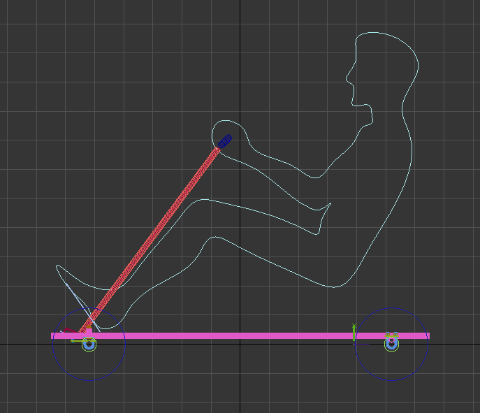
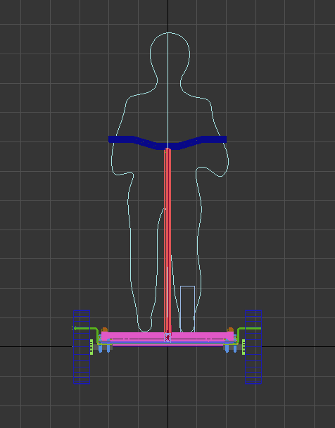
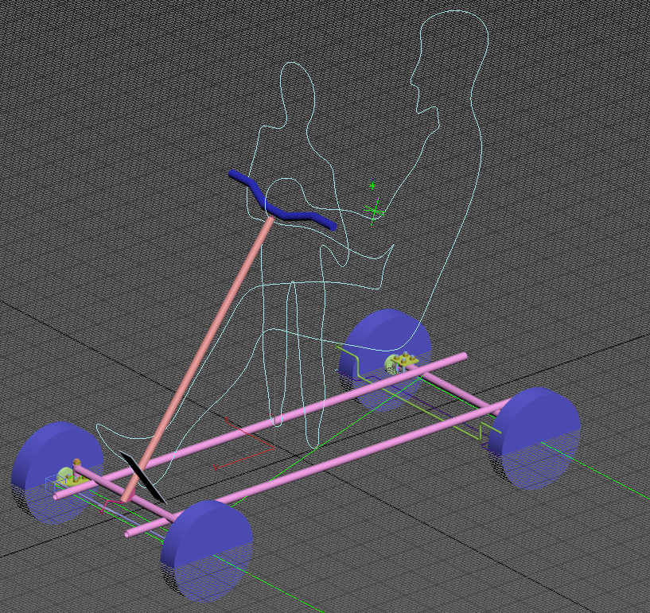
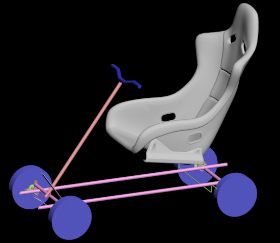
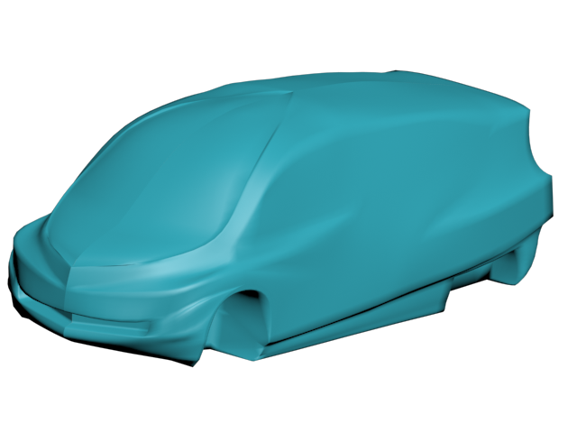
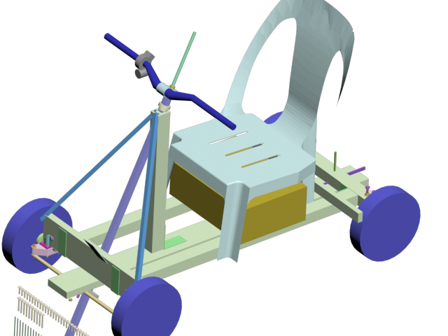
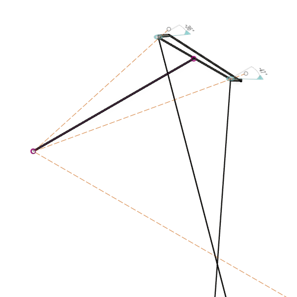
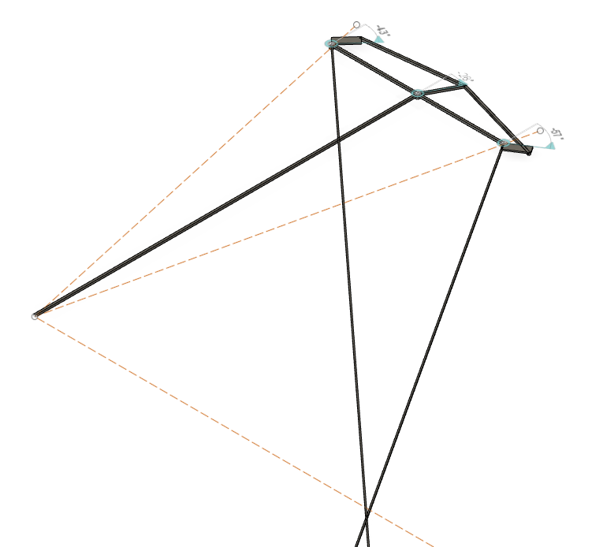

### История возникновения
У ребенка имелся гироскутер который через 1,5 года сломался (сдох аккумулятор), 
а так как считаю, гироскутер не практичной вещью, задумал пустить его на запчасти или сделать что-нибудь полезное.

Первая мысль - электросамокат (на мой взгляд куда более практичная вещь) изучив подобные переделки (электросамокат из гироскутера), 
пришло понимание, что самокат из таких запчастей тот еще монстр.
Основной недостаток конечно колеса 10 дюймов и длинная ось для крепления в одну сторону, 
еще немаловажный недостаток массивная тяжелая рама (к 13 кг гироскутера как минимум килограмм 5).
В итоге гораздо крупнее собратьев, не говоря об эстетической составляющей, было принято решение о не целесообразности такого изделия.
Бродя просторами интернета наткнулся на продажу новых гироскутеров, цена приятно удивила, почти в 2 раза дешевле за туже модель,
при этом получаем еще 2 колеса контроллер для них и аккумулятор.  
И родилась идея что можно монстра сделать на 4 колесах - электро карт с полным приводом. 
Отсутствие гаража наложило на конструкцию будущего изделия ограничения по габаритам, пройти в дверь, влезть в лифт.
 
Первым этапом стало создание [3d модели](scooter4ewd001.max)

Взяв проекцию как [сидит человек в обычной машине](https://www.google.com/search?q=%D0%BF%D1%80%D0%B0%D0%B2%D0%B8%D0%BB%D1%8C%D0%BD%D0%B0%D1%8F+%D0%BF%D0%BE%D1%81%D0%B0%D0%B4%D0%BA%D0%B0+%D0%B7%D0%B0+%D1%80%D1%83%D0%BB%D0%B5%D0%BC&tbm=isch), 
начал набрасывать расположение основных элементов. 
За основу строительного материала была взята металлическая труба 1/2 дюйма.
Конструкция обзавелась задней осью, передней осью, рамой, рулем. 

В 3D удобно проверить угол поворота колес, взаимодействие элементов конструкции, 
но нужно было решение простое в исполнении, так как то, что легко сделать в 3D, могло сильно усложнить реализацию. 
Так некоторые решения после моделирования были откинуты с мыслями для изготовления этой детали понадобится токарный, 
а то и фрезерный станок.
В результате самый сложный узел - рулевое управление, решил использовать цельную рулевую рейку сопряженную через петлю с осью руля.
Про "угла Аккермана" натыкался на видео в интернете, его заложил в конструкцию, но проверка на 3D модели выявила некоторые неточности,
описание которым так и не удалось найти в интернете,
длина рычагов, конструкция трапеции наверное накладывает свои корректировки, как результат цент задней оси был смещен во внутрь, 
что позволило добиться оптимального положения при максимальном вывороте, и неплохо на промежуточных углах, 
в идеале вопрос требует изучения, но для полу детской машинки решил оставить так.    

Имея на руках виртуальную раму захотелось сделать корпус, перебрав кучу материала, наиболее понравился, Mercedes-Benz Bionic, 
в результате получилась 
[3d модель](mercedes%20bionic.max)

А вот подружить две 3d модели не получилось нужно сильно укоротить и поднять, получился монстр. 

Хотелось попробовать в живую, проверять общую концепцию (влезет ли человек, зубы коленками не выбьет :-) ). 
Первый прототип был сделан из опилок (ДСП), вроде как нормально получилось в плане геометрии. 
Конечно, прототип не двигался, хрупкий материал требовал подпорок в нагруженных местах и со временем части начали разваливаться.

Хотелось собрать работающий прототип, но браться за сварочный не позволяли условия (отсутствие гаража), 
покопавшись в закромах были найдены деревянные брусья, пластмассовый стул.
Адаптировал [3d модель](scooter4ewd003.max) к новым материалам и строительство началось из них.

 
 
Собрав раму было решено, что стоит двигаться дальше - куплен второй гироскутер.
Здесь как в поговорке "скупой платит дважды", дешёвый гироскутер не работал, без предупреждения отключался и хватало его от силы на 10 минут.
Три раза меняли аккумулятор, каждый раз приходилось ездить в магазин, полностью заряжать, кататься пока не отключится. 
Последний вроде ничего, по крайней мере гироскутер предупреждал что садится.
Минусы на этом не закончились, сам гироскутер отличался от старого, особенно расстраивало наполовину пластмассовые колеса,
ранее они были полностью алюминиевые.
Как я узнал позже на собранном авто с подключенным ваттметром, мощность далека от заявленной, 
оба гироскутера позиционировали себя как 700вт (350вт на колесо),
замер же показал что старый 200Вт на колесо, новый 150Вт на колесо и довольно быстро начинает греться. 
Но на тот момент я об этом не знал, а был расстроен фактом что плата управления кардинально отличалась от описанной в [интернете](https://github.com/NiklasFauth/hoverboard-firmware-hack).
Изначально планировал использовать родной контроллер от гироскутера, но подружится с ним у меня не получилось,  
задумка перепрошить их была окончательно убита когда в ходе экспериментов по не осторожности статикой убил один из контроллеров. 
Плюнул и заказал на китайском сайте сразу ЧЕТЫРЕ контролера на электровелосипед для каждого колеса по 350вт каждый (что добавило 2 500 руб :-( ). 

Перешел к механике. Имея все 4 колеса столкнулся с проблемой как приделать их к раме да так чтобы еще поворачивать,
день рассматривания имеющихся деталей в строительном магазине завершился покупкой мебельных колес [№20](part/20/20part.md).
Плоская часть, площадка с отверстиями крепилась к оси колеса гироскутера [№1](part/01/01part.md), 
прижималась, выпиленной из бруса деталью, являющейся одновременно поворотным рычагом.
само колесико вынималось, а вилка обхватывало раму 

Рама стоит на 4 колесах, один контроллер был прикручен к доске та на петлях к раме, 
доску можно было наклонять и так машина самостоятельно смогла ездить (вперед/назад), но детишкам и этого было достаточно, 
без аварий не обошлось, специфика управления, а именно отпустив рычаг, платформа накланялась и контроллер давал полный газ вперед,
в результате следы покрышек на полу и сломанное крепление переднего колеса.

Сломанная деталь [№52](part/52/52part.md) напечатана за 3d принтере, доделано рулевое управление, 
понадобилась еще одна напечатанная деталь [№37](part/37/37part.md), конструкция поворачивает, дети продолжают кататься

Расматривая вариант возможности готовое изделие оставлять на улице все самое ценное с него должно быть съемным 
(чемоданчик с аккумуляторами и контролером),
ставится под сидение и подключается отключается, тут меня ждала суровая реальность 4 колеса от каждого 3 силовых провода 
и 5 проводов на датчики хола, общее питание конечно можно обединить, но итоговая цифра меньше не становилась, 
плюс провода управления. Вопрос звучал так "чем можно подключить 33 провода часть из которых силовые", 
в голове всплывали воспоменания о пром оборудовании и красивых мощных надежных раземах времен CCCP, 
но поиски не дали результата или ценник мягко говоря смущал, выбор остановил на разъеме похожий на компьютерный com порта только с 78 контактами.
И тут очередная суровая реальность припоять 176 проводка (2 разьема по 78 + 4 датчика хола по 5), 
что тут только небыло и осознание что паять не умею и оправдания паяльник не такой. 
С горем по полам распоял по составленой зарание [табличке](part/39/39part.md) все провода, здесь как уже упоменал в примечаниях я допустил ошибку,
что не стал припаивать провода к не задействованым пинам. 
Припаять 2 проводка для включения заднего хода на собранной машине стала грандиозной задачей.  

Пока идут детали решил заняться корпусом. С 3d не получилось, пробую в физическом мире, теперь за прототип взят милый автомобиль от гугла,
итоговый корпус планируется из стекловолокна, но надо с чего-то начинать - картон и ПВА. Легко резать, материала много, 
не жалко переделать, да и огрехи легко устранять, из минусов долго сохнет.
Весь корпус разделил: задний бампер, порог с частью пола (левый и правый), нос, верхняя часть кузова съемная, 2 двери. 
Лобовое стекло думал взять готовое, по городу катаются трехколесные скутеры развозки пиццы и по идеи товар ходовой, но цена в 9000 руб. остановила,
когда дойдет дело куплю лист прозрачного поликарбоната из минусов изгиб только в одно направление.

Ремарка: в процессе обклейки приходилось ворочать раму и даже в деревянном исполнении это > 25 кг, большую часть из которых составляет колеса,
так что на этом этапе есть четкое понимание что делать из стальных труб сделает машинку не транспортабельной, 
как вариант тонкая скилетная структура или алюминиевый профиль, 
ну или если работа со стекловолокном окажется не сложной можно попробовать из композитного материала, ну а, что помечтать то можно.

Контролеры пришли, в одной посылке, но все разные, разбираю и понимаю что это отремонтированные экземпляры, но делать нечего, 
проверяю, все работают. Прячем это все в чемодан, такого количества проводом я явно не ожидал, 
<!-- TODO -->
хорошо, что до включения питания решил прозвонить все провода, как в итоге 1 обрыв (при зачистке витой пары порвал жилу под оплеткой), 
1 замыкание (силовые провода, припаивая к пинам разъема делил на 4 и припаивал соответственно к четырем пинам и иногда объединял их оловом,
и от одного такого наплыва олово припаялось к соседней ноге, но другого провода). Убить транзисторы или еще чего не составит труда.

Выявленные проблемы:
Все четыре колеса работают, одно ведет себя странно, стартует раньше всех рывком, проверял, проверял, оказалось один датчик хола накрылся,
как результат контролер переходит в режим без датчиков хола. 
Плохо зажатый провод приводил к полной остановке машины после кочки.
Очень слабая тяга, если детям хватало, то мою тушку в 90кг на небольшом наклоне достаточно чтобы остановиться.
Тут оказалось питание на датчик хола ручки газа был занижено, взял 5 вольт с другого контроллера стало лучше.
Еще неприятная особенность контроллеров на велосипед, в отличии от гироскутера где режим удержания норма эти должны вращаться 
и если этого не происходит даже при малом токе контроллер вырубается, горку надо преодолевать на газу.

Не хватало заднего хода, провода для него нет, но так как плата контроллера видать была разработана как универсальная и как можно более функциональней, 
на ней есть контакт на который достаточно подать землю и мотор будет вращаться в реверсивном режиме. 
Припаять к платам контролера не составило труда, а вот добавить его на разъем очень сложно, когда уже все собрано.

Аккумуляторы работали в паре (параллельно) и их хватало на 30 минут катания ребенка, приобретённый ваттметр показал, 
что колеса совсем слабые в пике 700вт 25A.  

Из механических проблем больше всего доставлял руль, использование шпильки м10 как оси руля давало люфт градусов 30, 
торсионное скручивание было настолько ощутимо и не требовало больших усилий, даже та разность что одно колесо включалось раньше соседа 
поворачивало колеса при этом руль оставался неподвижен.

Шпильку заменил на алюминиевую трубу квадратного сечения, что потребовало немалых переделок в конструкции, 
так как детали напечатанные на 3D принтере показали себя хорошо, рулевое управление было во много сделано из напечатанных деталей.

Добавил тормоз, педаль тянула трос, который через блок прижимал к колесам брус. Испытания показали, что тормоза слабые, 
максимум, что удалось придумать это добавить еще один блок, что увеличит силу в 2 раза.

В таком состоянии катаемся, поломки по мелочам случаются, но в принципе эксплуатация нормально, 
докупил еще 2 аккумулятора от гироскутера, 
перепробовал несколько магазинов, но везде они далеки от заявленных 4.4 Ah, наилучшее что нашел 2.2 Ah. 
Теперь машинка проезжает 60 минут или 25 км. 
Начал делать электронный тормоз, на контроллере есть для этого контакты, припаял провод, 
замкнув его с землей контролер отключается, это поведение по умолчанию, но если замкнуть 2 контакта на контроллере то при торможении включает рекуперация.

Длительная поездка выявила основной недостаток конструкции - отсутствие подвески и какой либо амортизации.
Разбор конструкции и попытки добавить степеней свободы заканчивалось либо нет хода и конструкция такая же жесткая 
либо колеса начинали ходить во всех направлениях, более менее казалась идея второй рамы поверх первой с проставками, 
но колоссально увеличивались размеры, не оставалось места под чемодан, результата нет, собрал, как было.
Уходим в интернет, натыкаюсь на книгу "Книга самодеятельного конструктора автомобилей" рекомендую к прочтению.
Из неё взял макет [человека](man.max). 
Очень понравилась подвеска на торсионах, своей простотой и компактностью, подобная схема используется в дорогих электросамокатах, 
на первый взгляд система очень простая два квадрата большего и малого сечения помещённый внутрь первого со смещением на 45 градусов, 
а все свободное пространство заполнено эластичным элементом, пружина и амортизатор в одном.

Просматривая материалы, занесло в тематику постройку багги, какие вещи люде делают, можно только позавидовать, 
но насторожила фраза одного самодельщика что постройку надо начинать с поиск донора, так как целый автомобиль на порядок дешевле покупке запчастей,
цену за своего донора он озвучил в 15 000 рублей, я не поверил и полез в поиск б/у авто, у меня чуть челюсть не отвалилась,
оку на ходу с документами можно купить за 30 000 руб (цена на лето 2019 г.) что равно сумме вложенной в мою поделку на тот момент. 
Но желание сделать свое победило здравый смысл и переключился на создание виртуальную модель [v4](scooter4ewd004.max)  
. 

<!-- TODO Заказал гидравлические тормоза, когда пришли смоделировал проставку --> 

Угол Аккермана не давал покоя, сделал две модели:
  - Простая трапеция
 
[3D модель](akkerman01.f3d)

Геометрия была оптимальна только для некоторого угла в остальных случаях все было плохо.
  - Схема применяемая в картинге
 
[3D модель](akkerman02.f3d)

Вторая схема оказалась лучше, но на геометрию сильно влияла длина поворотного кулака и длина рулевой сошки, 
не найдя ответа как их расчитывать, решил определить методом перебора. 
Написал [программу](../src/main/java/scooter4ewd/BruteForceAnkerman.java) 
которая перебирала значения и определяла оптимальные значения, перенеся полученные значения на 3d модель, 
точка пересечения осей передних колес была наиболее близка к задней оси, но всё равно не идеально.

Итоги
задумывался как дешевый, по факту > 30 000 руб, и это при попытках сэкономить на всем

TODO