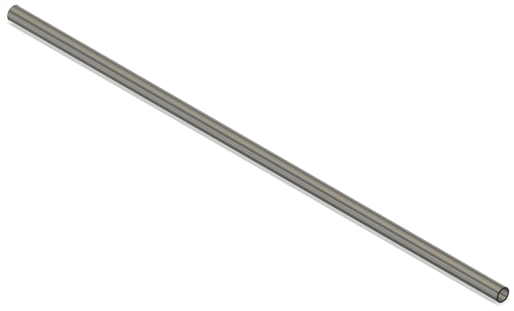

# Трубка алюминиевая d12х490

Трубка алюминиевая диаметр 12мм длина 490мм, с двумя отверстиями диаметорм 5мм с краев, в 5мм от края. Растояние между отверстиями должно составлять 480мм. 

[3D модель](27part.f3d)