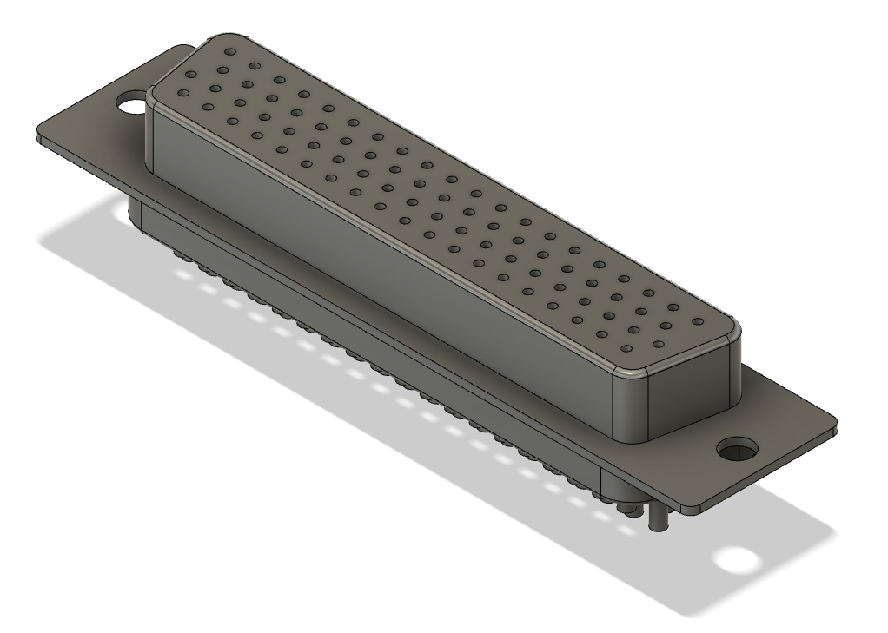
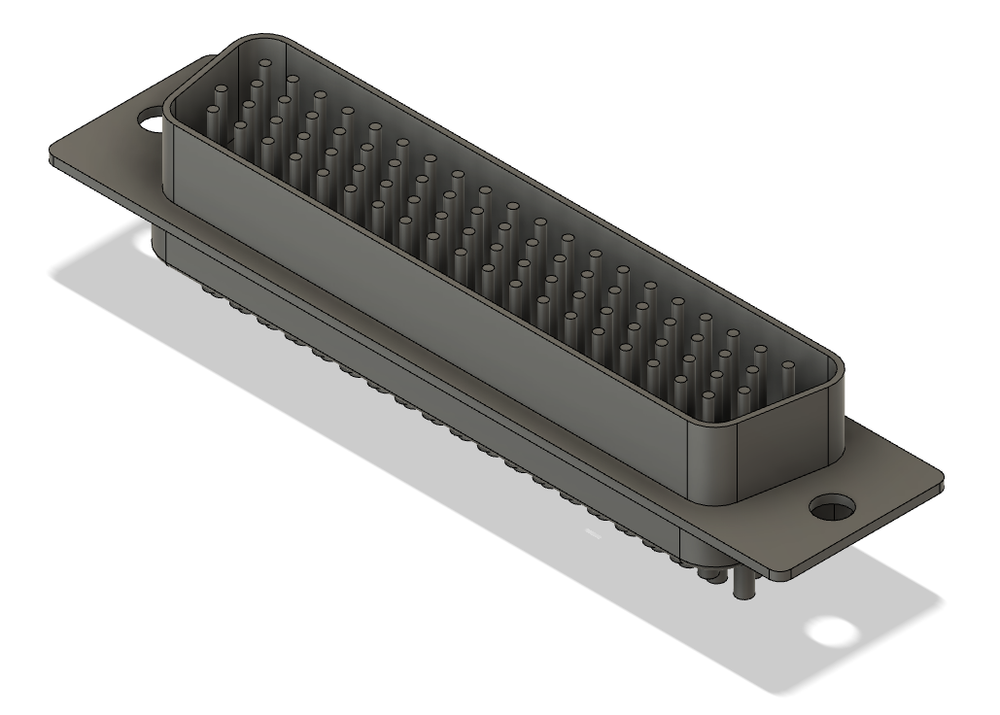

# Разем DHS-78

Разем DHS-78

## Распайка разъема

| № Pin | Ряд | Обозначение | Расшифровка |
| ------ | --- | ----------- | ----------- |
| 1  | 1 | кппж | колесо передний правый желтый |
| 2  | 1 | кппж |  |
| 3  | 1 | кппз | колесо передний правый зеленый |
| 4  | 1 | кппз |  |
| 5  | 1 | кппс | колесо передний правый синий |
| 6  | 1 | кппс |  |
| 7  | 1 | кплж | колесо передний левый желтый |
| 8  | 1 | кплж |  |
| 9  | 1 | кплз | колесо передний левый зеленый |
| 10 | 1 | кплз |  |
| 11 | 1 | кплс | колесо передний левый синий |
| 12 | 1 | кплс |  |
| 13 | 1 | s+36 | speed +36v (от аккумулятора) |
| 14 | 1 | s вкл | speed вкл. контроллера (замыкается на провод +36v) |
| 15 | 1 | задний ход 1 | задний ход 1 TODO (земля) |
| 16 | 1 | speed | speed уровень газа (+1v .. +4v) |
| 17 | 1 | задний ход 2 | задний ход 2 TODO (замыкается за землю) |
| 18 | 1 | s+5 | speed +5v |
| 19 | 1 | хп+5 | холла передний +5v |
| 20 | 1 | хз+5 | холла задний +5v |
| 21 | 2 | кппж |  |
| 22 | 2 | кппж |  |
| 23 | 2 | кппз |  |
| 24 | 2 | кппз |  |
| 25 | 2 | кппс |  |
| 26 | 2 | кппс |  |
| 27 | 2 | кплж |  |
| 28 | 2 | кплж |  |
| 29 | 2 | кплз |  |
| 30 | 2 | кплз |  |
| 31 | 2 | кплс |  |
| 32 | 2 | кплс |  |
| 33 | 2 | хппж | холла передний правый желтый |
| 34 | 2 | хппз | холла передний правый зеленый |
| 35 | 2 | хппс | холла передний правый синий |
| 36 | 2 | хплж | холла передний левый желтый |
| 37 | 2 | хплз | холла передний левый зеленый |
| 38 | 2 | хплс | холла передний левый синий |
| 39 | 2 |  |  |
| 40 | 3 | кзпж | колесо задний правый желтый |
| 41 | 3 | кзпж |  |
| 42 | 3 | кзпз | колесо задний правый зеленый |
| 43 | 3 | кзпз |  |
| 44 | 3 | кзпс | колесо задний правый синий |
| 45 | 3 | кзпс |  |
| 46 | 3 | кзлж | колесо задний левый желтый |
| 47 | 3 | кзлж |  |
| 48 | 3 | кзлз | колесо задний левый зеленый |
| 49 | 3 | кзлз |  |
| 50 | 3 | кзлс | колесо задний левый синий |
| 51 | 3 | кзлс |  |
| 52 | 3 | хзпж | холла задний правый желтый |
| 53 | 3 | хзпз | холла задний правый зеленый |
| 54 | 3 | хзпс | холла задний правый синий |
| 55 | 3 | хзлж | холла задний левый желтый |
| 56 | 3 | хзлз | холла задний левый зеленый |
| 57 | 3 | хзлс | холла задний левый синий |
| 58 | 3 |  |  |
| 59 | 3 |  |  |
| 60 | 4 | кзпж |  |
| 61 | 4 | кзпж |  |
| 62 | 4 | кзпз |  |
| 63 | 4 | кзпз |  |
| 64 | 4 | кзпс |  |
| 65 | 4 | кзпс |  |
| 66 | 4 | кзлж |  |
| 67 | 4 | кзлж |  |
| 68 | 4 | кзлз |  |
| 69 | 4 | кзлз |  |
| 70 | 4 | кзлс |  |
| 71 | 4 | кзлс |  |
| 72 | 4 |  |  |
| 73 | 4 |  |  |
| 74 | 4 | s- | speed минус (земля) |
| 75 | 4 | хп- | холла передний минус (земля) |
| 76 | 4 | хз- | холла задний минус (земля) |
| 77 | 4 |  |  |
| 78 | 4 |  |  |

Силовые провода к колесам используют по 4 пина, имеют одинаковое обозначение и расположены рядом - два на одном ряду и два на соседнем.

## 3D модели
- [Папа](39_1part.f3d)
- [Мама](39_2part.f3d)