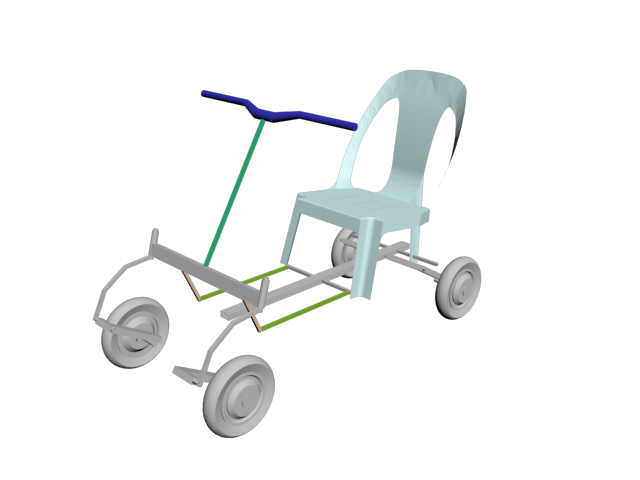

# Scooter4EWD 
**Scooter 4 electric wheel drive** - электрическое транспортного средства с четырьмя мотор колесами, на одну персону, созданное из доступных материалов.

## Перед началом
Все ниже описанное является собственным опытом и должно расцениваться как хобби, при попытке повторить вы должны оценить как материальные затраты > 30 000 рублей, так и временные ресурсы.

## Список деталей

| №  | Деталь                       | шт | Цена      | Сумма     |
| --- | ---------------------------- | ---| --------- | --------- |
| [1](readme/part/01part.md) | [Колесо гироскутера](readme/part/02part.md) | 4 | | 15000 (цена за 2 гироскутера) |
| [2](readme/part/02part.md) | [Брус 25х100х1250 (центральный лонжерон)](readme/part/02part.md) | 1 | | 100 |
| [3](readme/part/03part.md) | [Брус 25х100х500 (передняя ось)](readme/part/03part.md) | 1 | | |
| [4](readme/part/04part.md) | [Брус 40х50х960 (боковой лонжерон)](readme/part/04part.md) | 2 | | 150 |
| [5](readme/part/05part.md) | [Брус 40х50х480 (задняя ось)](readme/part/05part.md) | 1 | | |
| [6](readme/part/06part.md) | [Брус 40х50х407 (стойка рулевой колонки)](readme/part/06part.md) | 1 | | |
| [7](readme/part/07part.md) | [Брус 18х36х600 (Тормоз)](readme/part/07part.md) | 1 | | 50 |
| [8](readme/part/08part.md) | [Уголок 40х40](readme/part/08part.md) | 2 | 10 | 20 |
| [9](readme/part/09part.md) | [Уголок 40х95](readme/part/09part.md) | 3 | 20 | 60 |
| [10](readme/part/10part.md) | [Пластина 35х100](readme/part/10part.md)| 4 | 10 | 40 |
| [11](readme/part/11part.md) | [Рым гайка м8](readme/part/11part.md)| 4 | 70 | 280 |
| [12](readme/part/12part.md) | [Болт м8х80](readme/part/12part.md)| 4 | 15 | 60 |
| [13](readme/part/13part.md) | [Болт м8х50](readme/part/13part.md)| 1 | 10 | 10 |
| [14](readme/part/14part.md) | [Гайка м8х24](readme/part/14part.md)| 1 | 30 | 30 |
| [15](readme/part/15part.md) | [Гайка м8](readme/part/15part.md)| 5 | 10 | 50 |
| [16](readme/part/16part.md) | [Шайба м8](readme/part/16part.md)| 4 | 5 | 20 |
| [17](readme/part/17part.md) | [Болт м6х40](readme/part/17part.md)| 10 | 10 | 100 |
| [18](readme/part/18part.md) | [Гайка м6](readme/part/18part.md)| 11 | | 50 |
| [19](readme/part/19part.md) | [Шайба м6](readme/part/19part.md)| 8 | | 40 |
| [20](readme/part/20part.md) | [Колесо мебельное 43х58 d40](readme/part/20part.md)| 2 | | 300 |
| [21](readme/part/21part.md) | [Болт м5х50](readme/part/21part.md)| 2 | | 30 |
| [22](readme/part/22part.md) | [Гайка м5](readme/part/22part.md)| 4 | | 20 |
| [23](readme/part/23part.md) | [Шайба м5](readme/part/23part.md)| 2 | | 10 |
| [24](readme/part/24part.md) | [Ось руля 20х20х1000](readme/part/24part.md)| 1 | | 75 |
| 25 | | | | |
| 26 | | | | |
| [27](readme/part/27part.md) | [Трубка алюминиевая d12х480](readme/part/27part.md)| 1 | | 50 |
| [28](readme/part/28part.md) | [Пластина 25х60](readme/part/28part.md)| 1 | | 20 |
| [29](readme/part/29part.md) | [Вынос руля](readme/part/29part.md)| 1 | | 25 |
| [30](readme/part/30part.md) | [Уголок алюминиевый 15х580](readme/part/30part.md)| 2 | | 100 |
| [31](readme/part/31part.md) | [Стул пластмассовый](readme/part/31part.md)| 1 | | 300 |
| [32](readme/part/32part.md) | [Руль велосипедный](readme/part/32part.md)| 1 | | 600 |
| [33](readme/part/33part.md) | [Ручка газа](readme/part/33part.md)| 1 | | 460 |
| [34](readme/part/34part.md) | [Саморез 25](readme/part/34part.md)| 59 | | 100 |
| [35](readme/part/35part.md) | [Саморез 50](readme/part/35part.md)| 10 | | 20 |
| [36](readme/part/36part.md) | [Стяжка 3х200](readme/part/36part.md)| 17 | | 150 |
| [37](readme/part/37part.md) | [Поворотный механизм - петля](readme/part/37part.md)| 1 | | 200 |
| [38](readme/part/38part.md) | [Чемодан](readme/part/38part.md)| 1 | | 1500 |
| [39](readme/part/39part.md) | [Разъем DHS-78](readme/part/39part.md)| 1 | | 400 |
| [40](readme/part/40part.md) | [Провод силовой](readme/part/40part.md)| 10 | | |
| [41](readme/part/41part.md) | [Витая пара](readme/part/41part.md)| 10 | | |
| [42](readme/part/42part.md) | [Рукав металлический](readme/part/42part.md)| 1 | | 50 |
| [43](readme/part/43part.md) | [Клеммная колодка](readme/part/43part.md)| 4 | | 50 |
| [44](readme/part/44part.md) | [Трос d3мм в изоляторе](readme/part/44part.md)| 2м | | 40 |
| [44](readme/part/44part.md) | [Трос d3мм в изоляторе](readme/part/44part.md)| 2м | | 40 |
| [45](readme/part/45part.md) | [Блок для троса](readme/part/45part.md)| 1 | | 70 |
| [46](readme/part/46part.md) | [Зажим для троса](readme/part/46part.md)| 2 | | 20 |
| [47](readme/part/47part.md) | [Пружина на растяжение](readme/part/47part.md)| 2 | 24 | 48 |
| [48](readme/part/48part.md) | [Болт крюк м6](readme/part/48part.md)| 1 | 40 | 40 |
| [49](readme/part/49part.md) | [Петля ввертная](readme/part/49part.md)| 2 | 45 | 90 |
| [50](readme/part/50part.md) | [Алюминиевый профиль 10х18х400](readme/part/50part.md)| 2 | | 50 |
| [51](readme/part/51part.md) | [Брус 16х51х150 (Педаль тормоза)](readme/part/51part.md)| 1 | | |
| [52](readme/part/52part.md) | [Поворотный механизм - кулак левый](readme/part/52part.md)| 1 | | 300 |
| [53](readme/part/53part.md) | [Поворотный механизм - кулак правый](readme/part/53part.md)| 1 | | 300 |
| [54](readme/part/54part.md) | [Втулка оси руля (низ)](readme/part/54part.md)| 1 | | 300 |
| [55](readme/part/55part.md) | [Подшипник руля (болт)](readme/part/55part.md)| 2 | | 300 |
| [56](readme/part/56part.md) | [Подшипник руля (гайка)](readme/part/56part.md)| 2 | | 300 |
| [57](readme/part/57part.md) | [Втулка оси руля (верх)](readme/part/57part.md)| 1 | | 300 |
| [58](readme/part/58part.md) | [Аккумулятор](readme/part/58part.md)| 2 | 1950 | 3900 |
| [59](readme/part/59part.md) | [Контроллер электродвигателя 350wt](readme/part/59part.md)| 4 | 600 | 2400 |
| [60](readme/part/60part.md) | [Зарядное устройство от героскутера](readme/part/60part.md)| 1 | | |
| [61](readme/part/61part.md) | [Автомат защиты](readme/part/61part.md)| 1 | 150 | 150 |
| [62](readme/part/62part.md) | [Ваттметр](readme/part/62part.md)| 1 | 700 | 700 |
| [63](readme/part/63part.md) | [Кнопка заднего хода](readme/part/63part.md)| 1 | 70 | 70 |
| [64](readme/part/64part.md) | [Кнопка нажатия тормоза](readme/part/64part.md)| 1 | 50 | 50 |
| [65](readme/part/65part.md) | [Блок кнопок на руль](readme/part/65part.md)| 1 | 200 | 200 |
| [66](readme/part/66part.md) | [Грипсы](readme/part/66part.md)| 2 | | 300 |
| [67](readme/part/67part.md) | [Ротор дискового тормоза](readme/part/67part.md)| 2 | | |
| [68](readme/part/68part.md) | [Суппорт дискового тормоза](readme/part/68part.md)| 2 | | 2500 |
| [69](readme/part/69part.md) | [Гидролиния](readme/part/69part.md)| 2 | | |
| [70](readme/part/70part.md) | [Ручка тормаза](readme/part/70part.md)| 2 | | |
| [71](readme/part/71part.md) | [Проствка для ротора дискового дормаза](readme/part/71part.md)| 2 | | |
| | | | **итого** | **32988** |

## Как строить
1. TODO 

[Распайка разъема](../part/39part.md)

## Замечания и рекомендации
TODO

## Лирика 
Раздел не несет технической информации, но может внести ясность почему так получилось. 
[Читать далее->](readme/history.md)

